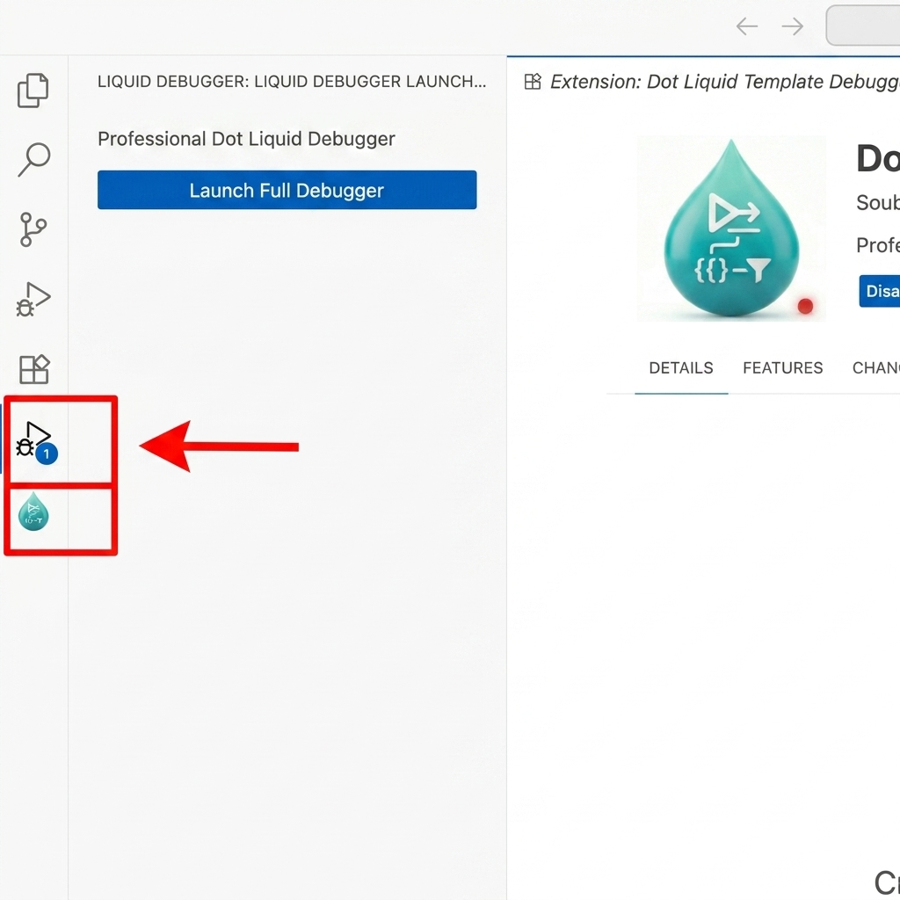
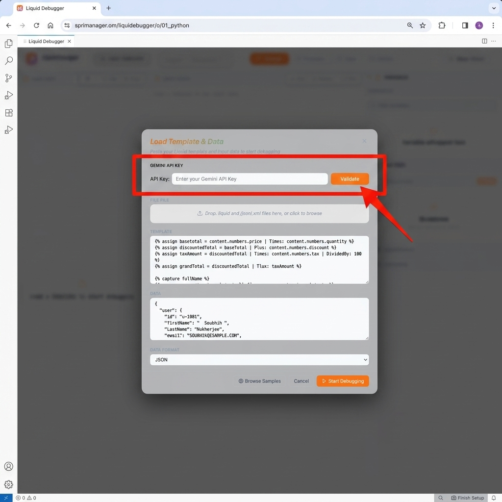
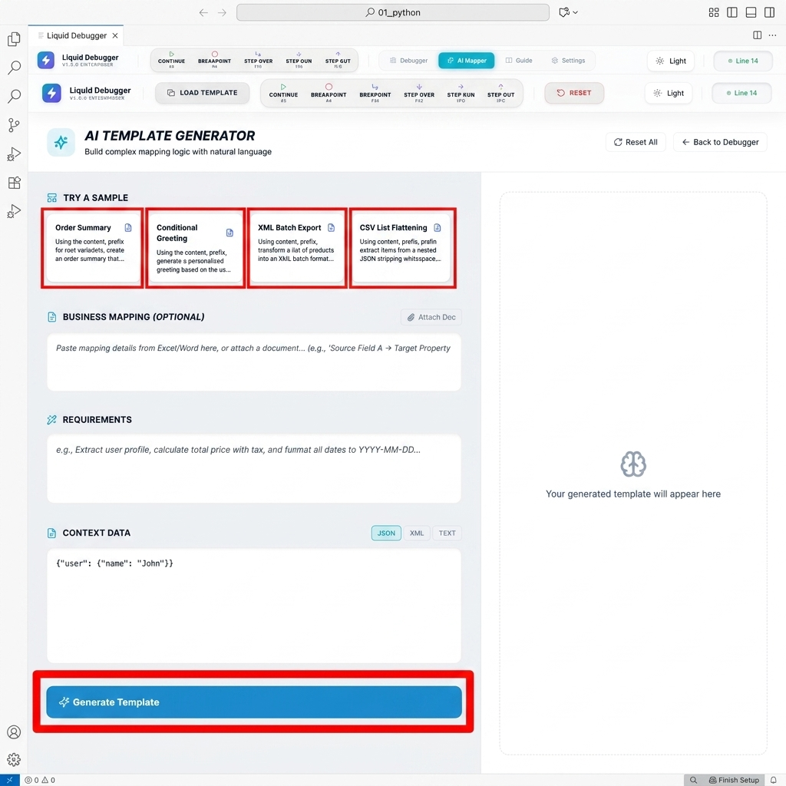
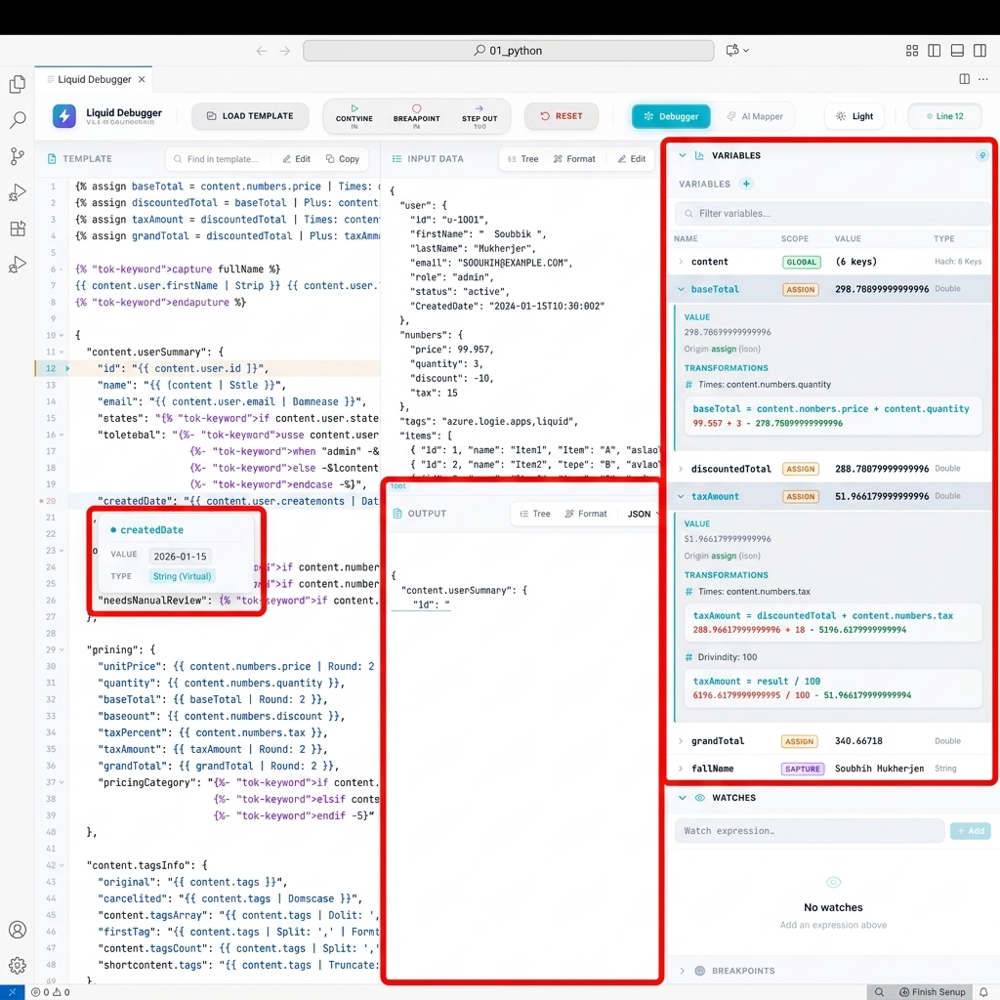
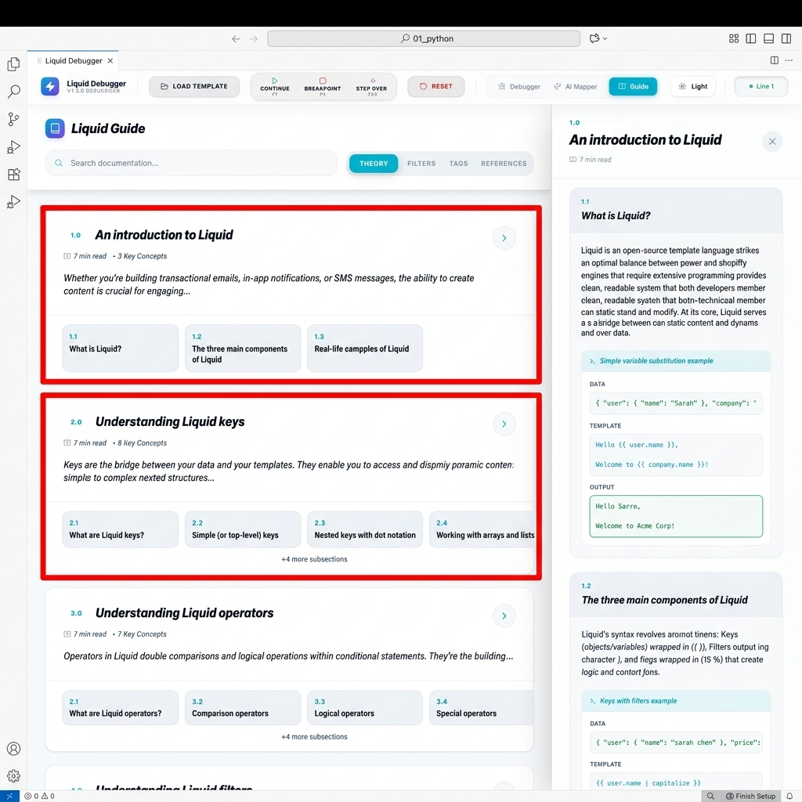

<p align="center">
  
</p>

<h1 align="center">Dot Liquid Template Debugger V2</h1>

<p align="center">
  <b>The industry-standard debugging environment for complex Liquid templates.</b><br>
  <i>Eliminate guesswork with deterministic, line-by-line execution and real-time visualization.</i>
</p>

<p align="center">
  <a href="https://marketplace.visualstudio.com/items?itemName=SoubhikDevTools.dot-liquid-template-debugger">
    
  </a>
  <a href="https://marketplace.visualstudio.com/items?itemName=SoubhikDevTools.dot-liquid-template-debugger">
    
  </a>
  <a href="https://marketplace.visualstudio.com/items?itemName=SoubhikDevTools.dot-liquid-template-debugger">
    
  </a>
</p>

---

## 🚀 Mastering the Workflow

### **Step 1: Launch the Debugger**
Access the extension via the custom Activity Bar icon on the left. This dedicated entry point keeps your workspace clean while providing instant access to all debugging tools.



### **Step 2: Setup & API Configuration**
Load your Liquid template and sample data. If you want to use the AI Template Mapper, provide your **Gemini API Key**. 
> [!NOTE]
> For security, your API key is stored in VS Code's native `SecretStorage` and never exposed in plaintext.



### **Step 3: AI-Powered Template Generation**
Struggling with complex mapping logic? Use the **AI Template Mapper**. Describe your requirements in plain English or use one of the pre-configured samples to generate production-ready Liquid code instantly.



### **Step 4: Real-Time Debugging Environment**
Once your template is loaded, use the line-by-line debugger to inspect variable transformations.
*   **Variables Panel**: Track all assigned variables and their original vs. transformed values.
*   **Hover Diagnostics**: Simply hover over any Liquid tag to see its evaluated value in the current context.
*   **Live Output**: Watch your JSON/XML/CSV output build dynamically as you step through the code.



### **Step 5: Interactive Learning Guide**
New to Liquid? Our built-in **Interactive Guide** provides a comprehensive reference for syntax, filters, and best practices, complete with interactive examples you can run directly.



---

## 💎 Why Professionals Choose V2

| **Insight** | **Capability** |
| :--- | :--- |
| **Deterministic Tracking** | See exactly how variables are modified by filters in a step-by-step history. |
| **AI-Powered Mapping** | Generate complex transformations instantly with our built-in Gemini-powered mapper. |
| **Multi-Format Native** | First-class support for **JSON**, **XML**, and **CSV** payloads with syntax-aware rendering. |
| **Enterprise Ready** | Hardened with a rigorous security audit; local-first performance with zero data leakage. |

---

## 🔒 Enterprise-Grade Security

We take developer privacy and enterprise security seriously. The extension has undergone a **5-round security audit** to ensure the highest standards:

*   **Zero Egress**: Your code and data never leave your local machine (AI requests are opt-in and sanitized).
*   **Secure Secret Storage**: API keys are stored in VS Code's native `SecretStorage`.
*   **Sanitized AI Pipeline**: Multi-pass regex sanitization redacts PII/tokens before transmission.
*   **DoS Protection**: Strict size limits and expression complexity guards prevent resource exhaustion.

---

## 🛠️ Configuration

For advanced teams, use a `.vscode/launch.json` to persist your debugging environments:

```json
{
  "version": "0.2.0",
  "configurations": [
    {
      "type": "liquid",
      "request": "launch",
      "name": "Debug Liquid Template",
      "template": "${file}",
      "data": "${workspaceFolder}/data.json",
      "format": "json"
    }
  ]
}
```

---

## Support & Community

- **Issue Tracker**: [Report a Bug](https://github.com/soubhik7/LiquidTemplateDebugger/issues)
- **Contribution**: [GitHub Repository](https://github.com/soubhik7/LiquidTemplateDebugger)

<p align="center">
  <i>Developed with ❤️ for the Liquid Community by Soubhik and Bob.</i>
</p>


