<div align="center">
  
  <h1>Dot Liquid Template Debugger</h1>
  <p><strong>A professional-grade debugging environment for Liquid templates.</strong></p>

  [](https://marketplace.visualstudio.com/items?itemName=SoubhikDevTools.dot-liquid-template-debugger)
  [](https://marketplace.visualstudio.com/items?itemName=SoubhikDevTools.dot-liquid-template-debugger)
  [](https://marketplace.visualstudio.com/items?itemName=SoubhikDevTools.dot-liquid-template-debugger)
</div>

Stop guessing why your templates aren't rendering correctly. Step through them line-by-line with full visibility into every variable transformation.

##  Core Features

* **Instant Feedback**: See exactly what your template is doing as it executes.
* **Line-by-Line Execution**: Execute your templates instruction by instruction. Watch the output panel build in real-time as you step through loops and conditional branches.
* **Transformation History**: See exactly how variables are modified by filters (e.g., `{{ "hello" | capitalize | append: "!" }}`).
* **Multi-Format Support**: Native support for **JSON**, **XML**, and **CSV** data formats. Perfect for web APIs, enterprise systems, and raw data processing.
* **Azure Logic Apps Integration**: Seamlessly handle data wrapped in the Logic Apps `content` property.

---

##  Quick Start

1. **Install** the extension from the VS Code Marketplace.
2. **Open** any `.liquid` template file.
3. **Start Debugging**: Press `F5` or open the command palette and type **"Liquid: Start Debugging"**.
   
   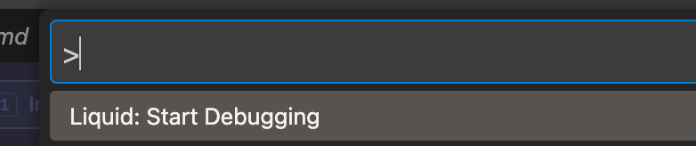
4. **Load Data**: The Debugger Panel will appear. Click **Load** to paste your Data.
   
   
   
   You can easily load XML or JSON data via the data modal:
   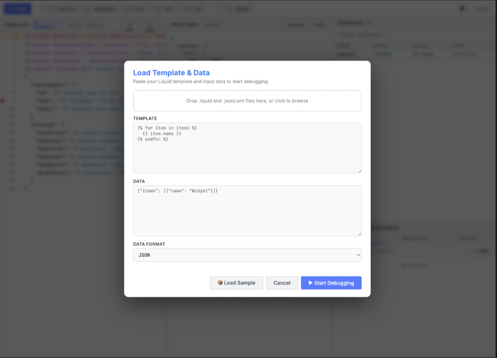

   Not sure where to start? Just click **Load Sample** to instantly populate the debugger with sample templates and data!
   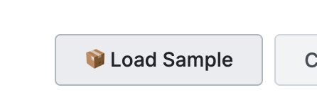
5. **Debug**: Use standard controls (`F10` for Step Over, `F5` for Continue) to explore your template.

> **Note:** Templates must end in `.liquid` and require VS Code 1.85.0 or higher.

---


### The Debugging Environment
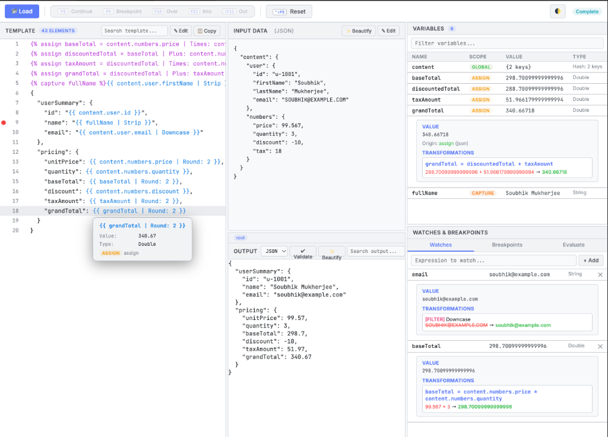
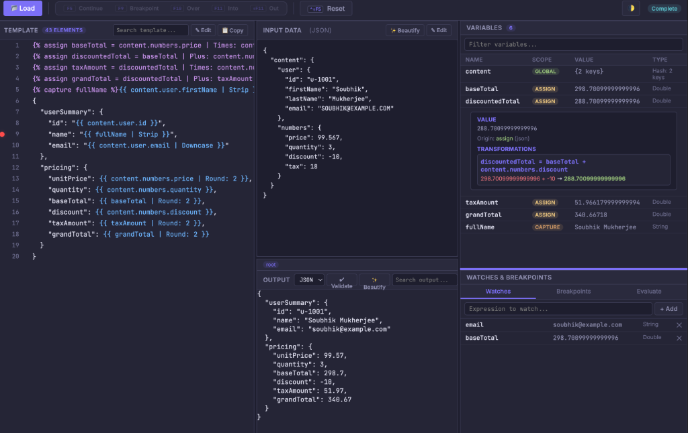
*Complete overview of the template, input data, real-time output, and variable states with full Light and Dark mode support.*

### Step-by-Step Execution
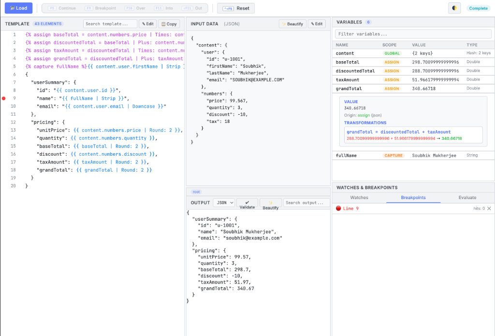
*Pause execution on any line and inspect variables at that exact moment.*

### Variable Transformations & Evaluation
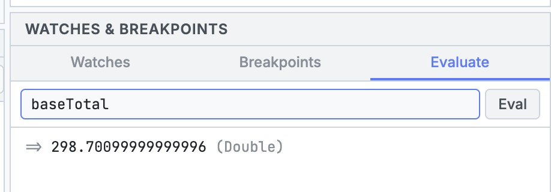
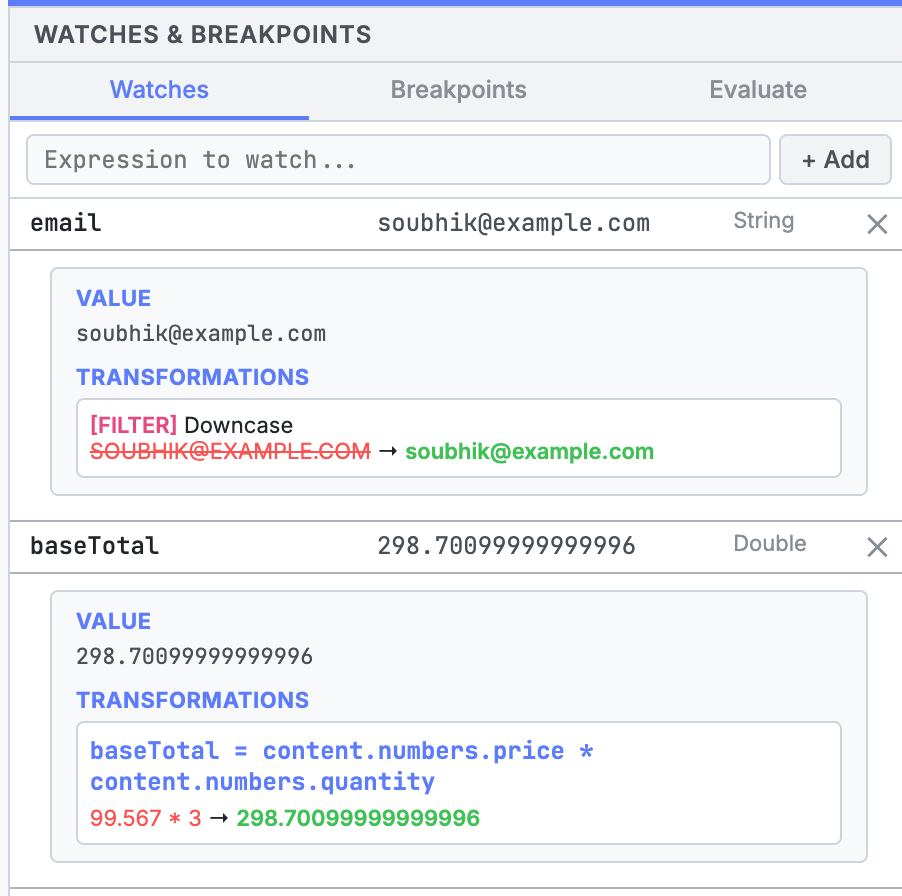
*Track how filters modify your variables step-by-step and evaluate expressions on the fly.*

### XML Data Support
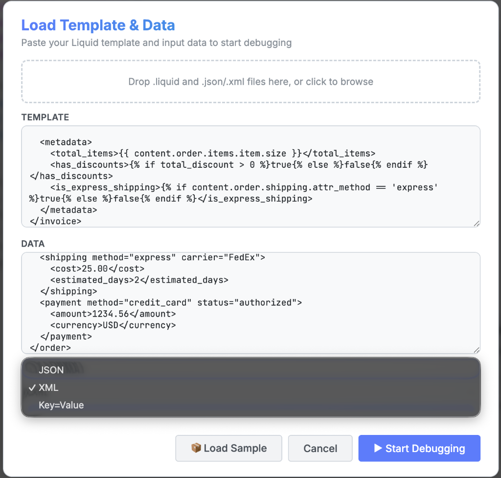
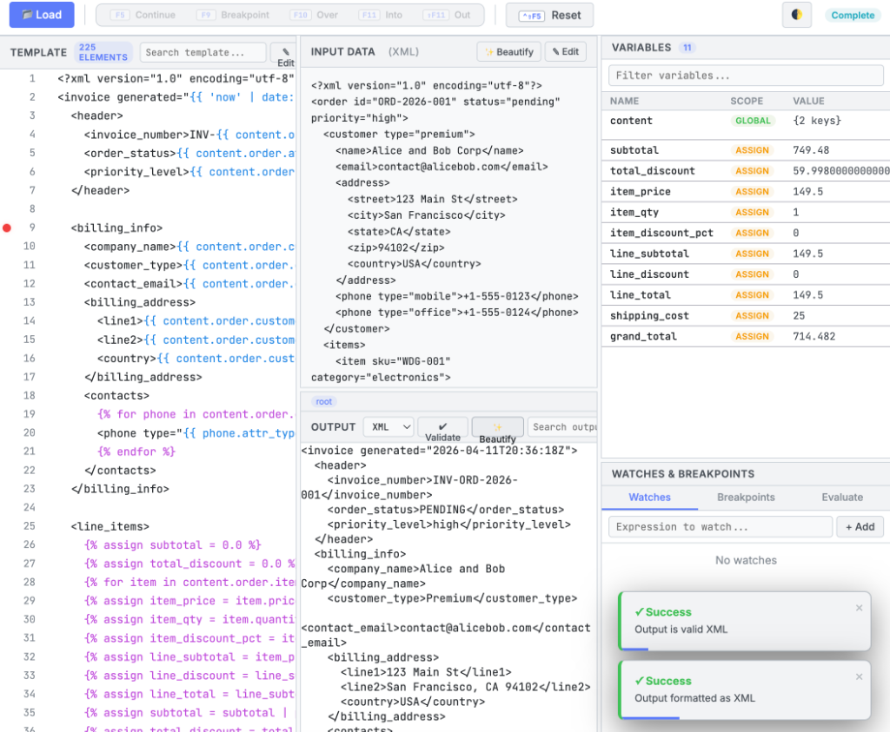
*First-class support for debugging complex XML payloads and evaluating their properties natively.*

### Editor Utilities
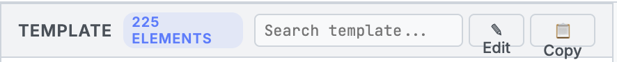
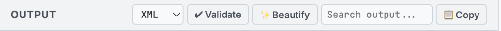
*Easily search, copy, format, and validate your code right inline within your active debug session.*

---

##  Configuration (Optional)

Create a `.vscode/launch.json` for persistent configurations:

```json
{
  "version": "0.2.0",
  "configurations": [
    {
      "type": "liquid",
      "request": "launch",
      "name": "Debug Liquid Template",
      "template": "${file}",
      "data": "${workspaceFolder}/data.json",
      "format": "json",
      "stopOnEntry": true
    }
  ]
}
```

### Extension Settings

| Setting | Description |
|---------|-------------|
| `liquid-debugger.start` | Launches the interactive debugger for the current file. |
| `liquid-debugger.loadData` | Programmatically loads a new data payload into the current session. |
| `liquid-debugger.showDebugger` | Toggles the visibility of the specialized liquid debugger panel. |

---

##  Support & Feedback

Encountered a bug or have a feature request?
- **Issues**: [GitHub Issues](https://github.com/soubhik1/liquid-template-debugger-pro/issues)
- **Repository**: [Source Code](https://github.com/soubhik1/liquid-template-debugger-pro)

---
*Developed by collaboration between Soubhik and Bob for the Liquid Community.*